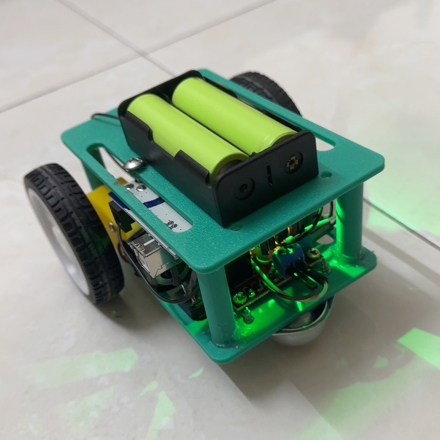
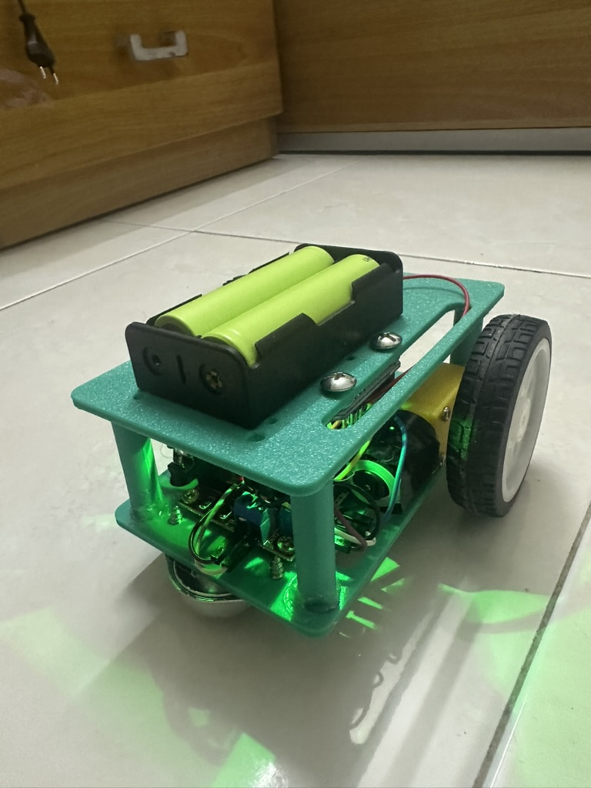
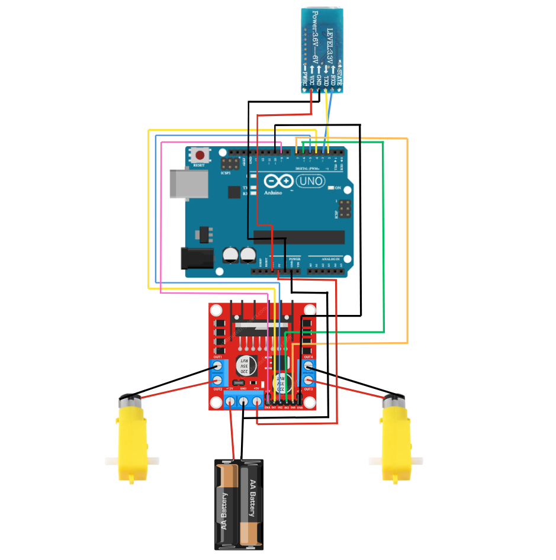

# Arduino Remote-Controlled Car with Dabble App

This project implements a Bluetooth-controlled car using an Arduino board, the Dabble app, and a motor driver. The car is operated via a gamepad interface in the Dabble app, allowing users to move the car forward, backward, turn left, and turn right. The code also includes speed adjustment to correct for motor drift.

## Features

- **Directional Control**: Forward, backward, left, and right movements using the gamepad in the Dabble app.
- **Speed Adjustment**: Corrects motor drift for smoother straight-line movement.
- **Bluetooth Control**: Uses a Bluetooth module to communicate with the Dabble app on a smartphone.
- **Easy Setup**: Modular code design for simplicity and adaptability.

## Demo

### Images

Here are some images of the car setup and hardware connections:

#### Car Images:




#### Circuit Connections:



### Video Demo

Watch the car in action!  
[](https://www.youtube.com/watch?v=your_video_id)

## Hardware Requirements

- **Arduino Board**: Compatible with Uno, Mega, or Nano.
- **Motor Driver**: L298N or similar.
- **Bluetooth Module**: HC-05, JDY-33, or similar.
- **Motors and Chassis**: Suitable for a two-wheel or four-wheel drive car.
- **Power Supply**: Ensure adequate voltage and current for the motors and Arduino.

## Software Requirements

- **Arduino IDE**: Download from [Arduino Official Website](https://www.arduino.cc/en/software).
- **Dabble App**: Available on [Google Play Store](https://play.google.com) or [Apple App Store](https://apps.apple.com).


## How to Run the Code

### Step 1: Install Required Libraries

This project uses the **Dabble** library. Follow these steps to install it:

1. Open the Arduino IDE.
2. Go to **Tools > Manage Libraries**.
3. In the Library Manager, search for `Dabble` and click **Install**.
4. Once installed, include the library in your code:

```cpp
#define CUSTOM_SETTINGS
#define INCLUDE_GAMEPAD_MODULE
#include <Dabble.h>
```

### Step 2: Clone the Repository

1. Clone this repository to your local machine:
   ```bash
   git clone https://github.com/your-username/arduino-remote-car.git
   cd arduino-remote-car
   ```
2. Open the .ino file in the Arduino IDE.

### Step 3: Set Up the Hardware

1. Connect your Arduino, motor driver, Bluetooth module, and motors as described [circuit connection](#circuit-connections).
2. Ensure the Bluetooth module is paired with your smartphone.

### Step 4: Upload the Code

1. Connect the Arduino to your computer via USB.
2. Select the correct board and port in Tools > Board and Tools > Port.
3. Click Upload to upload the code to the Arduino.

### Step 5: Control the Car

1. Open the Dabble App on your smartphone.
2. Connect to the Bluetooth module.
3. Select the Gamepad Module in the app.
4. Use the gamepad controls to operate the car.

## Code Explaination

The code uses the Dabble library to process gamepad inputs. It adjusts motor speeds using PWM signals to control movement and correct motor drift.

### Functions

- moveForward(speed): Moves the car forward.
- moveBackward(speed): Moves the car backward.
- turnLeft(speed): Turns the car left.
- turnRight(speed): Turns the car right.
- stopMotors(): Stops all motor activity.

## Troubleshooting

- Car Drifting: Adjust the driftCorrection constant in the code to fine-tune motor speeds.
- Bluetooth Not Connecting:
  - Ensure the module is powered and properly connected.
  - Confirm pairing with the correct device.
- Motors Not Moving:
  - Verify wiring connections.
  - Check if the motor driver is powered correctly.

## Resources

- **Bill of Materials**: [Link to BOM](https://your-link-to-bom)  
- **SolidWorks Design Files**: [Link to SolidWorks Design](https://your-link-to-solidworks-design)  
- **Project Folder**: [Link to Shared Folder](https://your-shared-folder-link)

You can download these resources for a detailed breakdown of the components and to view or modify the 3D design of the car.

## Contact

For questions or feedback, please contact:

- Email: vantaingo.056@gmail.com
- GitHub: TaiVanNgo
